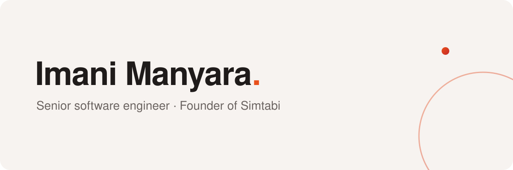

  

<!-- Replace the image above with the brand hero when assets/hero-{light,dark}.svg
     land, per /opensource/simtabi-brand-design-standard.md:

  <a href="https://imanimanyara.com">
    <picture>
      <source media="(prefers-color-scheme: dark)" srcset="assets/hero-dark.svg">
      
    </picture>
  </a>

-->

Senior software engineer and founder of [Simtabi](https://simtabi.com), a software
design agency and design & branding studio. I build developer tooling and Laravel
packages, and open-source the parts worth sharing.

Author of the [laranail](https://github.com/laranail) package family —
[`package-tools`](https://github.com/laranail/package-tools),
[`package-scaffolder`](https://github.com/laranail/package-scaffolder),
[`database-tools`](https://github.com/laranail/database-tools),
[`console`](https://github.com/laranail/console),
[`enumerator`](https://github.com/laranail/enumerator) — and of the developer
tools at [@simtabi](https://github.com/simtabi), including
[`probaci`](https://github.com/simtabi/probaci),
[`osaat`](https://github.com/simtabi/osaat), and
[`repoclone`](https://github.com/simtabi/repoclone). Everything we publish lives
at [opensource.simtabi.com](https://opensource.simtabi.com).

<!-- Activity since 2023 — enable after self-hosting streak-stats on Vercel
     (DenverCoder1/github-readme-streak-stats + PAT), per the brand standard.
     Shared public instances are rate-limited and must never be embedded.

  <picture>
    <source media="(prefers-color-scheme: dark)" srcset="https://YOUR-INSTANCE.vercel.app/?user=imanimanyara&starting_year=2023&hide_border=true&background=00000000&stroke=E6E1DE&ring=FF5252&fire=FF7A45&currStreakLabel=FF9066&sideLabels=E6E1DE&currStreakNum=E6E1DE&sideNums=E6E1DE&dates=8B8683">
    
  </picture>

-->
<!-- Yearly activity calendar — uncomment after the metrics workflow
     (.github/workflows/metrics.yml, METRICS_TOKEN secret) has run once:

  

-->

[Website](https://imanimanyara.com) · [Simtabi](https://simtabi.com) ·
[Open source](https://opensource.simtabi.com) ·
[LinkedIn](https://linkedin.com/in/imanimanyara) ·
[X](https://x.com/imanimanyara) ·
[imani@simtabi.com](mailto:imani@simtabi.com)
